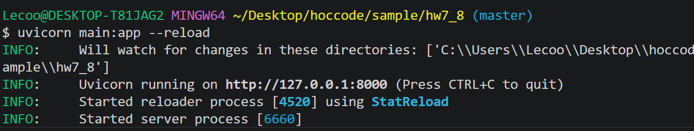
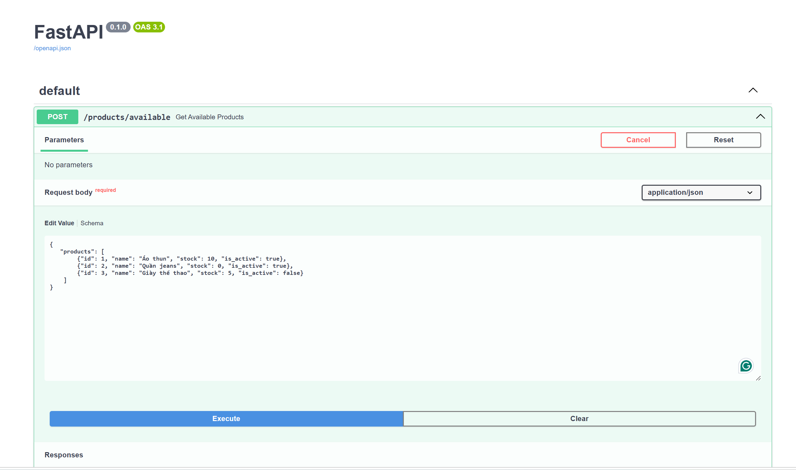

## Run thử để kiểm tra API

### 1. Chạy server: Kiểm tra mình đang đứng ở vị trí sample/hw7_8 hay ko. Nếu không thì cần "cd vào thư mục sample/hw7_8"


```bash
python main.py
```

Hoặc:

```bash
uvicorn main:app --reload
```

---

### 2. Gửi request

#### Sử dụng API Docs của FastAPI

- Mở trình duyệt và truy cập:

```bash
http://localhost:8000/docs
```

- Tìm endpoint:

```bash
POST /products/available
```


- Nhấn **Try it out**
- Dán payload JSON vào ô **Request body**
- Nhấn **Execute** để gửi request và xem kết quả


```json
{
    "products": [
        {
            "id": 1,
            "name": "Áo thun",
            "stock": 10,
            "is_active": true
        }
    ]
}
```